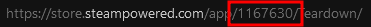

# Unsubscribe from unavailable workshop mods
Unsubscribes from unavailable mods which can fix some issues in games (due to them trying to download the mod over and over again).

# Usage
`unsubscribe_unavailable.exe <app_id>`

You can find the AppID by looking in the url of the game: 

In this case the AppID is `1167630`